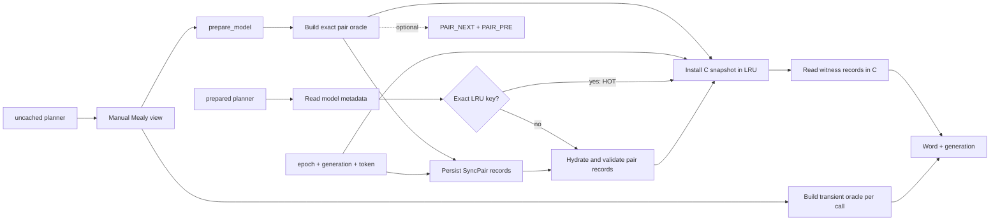
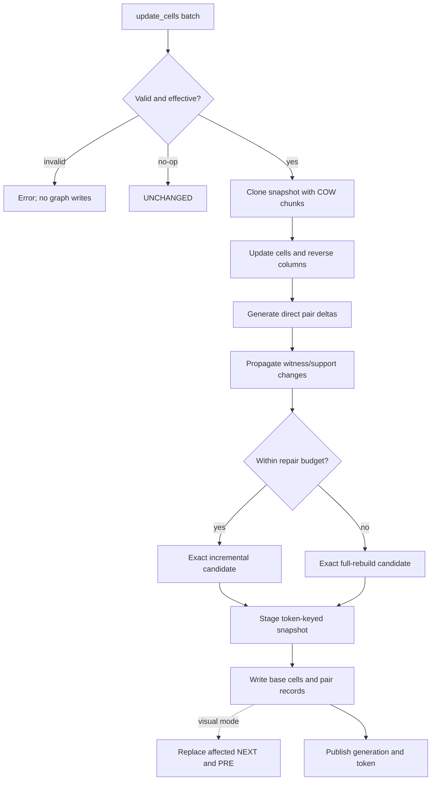

# Hacking On sync-kgraph

[README.md](README.md) is the end-user installation, mapping, API, and worked
example guide. This document covers implementation choices, contributor
workflows, correctness checks, and release engineering.

## Toolchain And Source Layout

The project uses C23, Meson, Clang, LLVM formatting, and LLVM clang-tidy rules.
The normal core build is:

```sh
CC=clang meson setup build -Dmemgraph=disabled
meson compile -C build
meson test -C build --print-errorlogs
./build/sync-kgraph-cli --example warehouse
```

Build the query module against the target server's `mg_procedure.h`:

```sh
CC=clang meson setup build-memgraph \
  -Dmemgraph=enabled \
  -Dmemgraph_include_dir=/usr/include/memgraph
meson compile -C build-memgraph
```

The main ownership boundaries are:

| Path | Responsibility |
| --- | --- |
| `include/sync_kgraph/sync.h` | Installed public C API |
| `src/sync.c` | Automaton construction, validation, and lookup |
| `src/oracle.c` | Exact pair-oracle construction and restoration |
| `src/planner.c` | Synchronization, homing, and bounded partition search |
| `src/dynamic.c` | Pair-witness repair from direct deltas |
| `src/snapshot.c` | Immutable/shareable prepared state and reverse indexes |
| `src/snapshot_cache.c` | Thread-safe process LRU keyed by model version |
| `src/memgraph/sync_module.c` | Memgraph extraction, persistence, and procedures |
| `tests/test_core.c` | Core, differential, snapshot, and cache tests |
| `tests/ablation_benchmark.c` | Deterministic native maintenance gate |

`snapshot.h`, `snapshot_cache.h`, and `sync_internal.h` are internal. They are
not installed and do not extend the public C ABI.

## Prepared-State Architecture

For `n` states, preparation builds `n(n + 1) / 2` unordered pairs with
repetition. Each pair record stores merge and resolution reachability,
distance, witness action, successor pair, and support count. The records are
persisted as `SyncPair` nodes so prepared state survives module restarts.

The process-local snapshot adds the structures needed to avoid database work on
hot planning and to repair updates efficiently:

- a validated automaton with the exact generation;
- shared pair topology and direct outgoing pair/action entries;
- reverse transition columns indexed by action and target state;
- pair records in 1,024-record reference-counted copy-on-write chunks; and
- the unique set of records changed by the current repair.

A mutex-protected LRU retains snapshots. Its exact key is
`(model, oracle_epoch, generation, snapshot_token)`. `snapshot_token` combines a
random process incarnation with a monotonic counter, so an entry from an old
module process or failed transaction cannot match current model metadata.



`HOT` means the exact snapshot was already in the LRU. `HYDRATED` means the
procedure rebuilt the process snapshot from durable pair records. `BYPASSED`
is reserved for uncached procedures. Hydration reads records in batches of
4,096 and validates the complete snapshot before exposing it.

The default LRU limit is 512 MiB. `SYNC_KGRAPH_CACHE_MAX_BYTES` accepts a
decimal byte limit; zero disables retention. Snapshot accounting is
conservative when topology or chunks are shared, which favors earlier eviction
over exceeding the configured cap.

## Incremental Maintenance

`update_cells` is available only for a clean model prepared with
`incremental: true`. The complete change batch is resolved and validated before
maintenance starts. Duplicate state/action cells are rejected, including
duplicates that separately change a target and output.

For an effective batch, the implementation:

1. Clones the current snapshot at the next generation.
2. Copies only chunks and reverse columns affected by changed cells.
3. Generates direct pair/action deltas in `O(changed_cells * states)`.
4. Re-evaluates seed records and propagates witness/support changes through
   reverse predecessors.
5. Builds and validates an exact full oracle if the repair budget is exceeded.
6. Stages the exact candidate in the LRU under a fresh, unreachable token.
7. Writes base cells, changed pair records, optional visual edges, and model
   metadata in one Memgraph transaction.

The metadata write exposes the new token only with the new generation. If the
transaction aborts, the staged entry is unreachable and is later evicted. No
partial prepared generation can be selected by a planner.



The repair is delta-first. A seed is invalidated only when its distance
increases; distance decreases are queued directly, and same-distance
witness/support changes are written without first destroying a valid record.
Reverse columns enumerate only predecessor states that can reach a changed
target under the affected action.

`repair_budget = 0` selects `ceil(pair_count / 4)`. Positive values are explicit
record-touch budgets. `-1` deliberately forces a full rebuild for the
maintenance ablation. Full rebuild remains an exact fallback, not a degraded or
approximate result.

This maintenance is DynFO-inspired, not a formal DynFO dynamic-complexity
claim. The implementation maintains witnesses, support counts, reverse indexes,
and predecessor propagation in C, while Memgraph transaction work and bounded
fallback remain part of the operational model.

## Correctness Invariants

The important invariants are:

- every automaton has exactly one transition and observation per state/action
  cell;
- state, action, and output keys are unique within a model;
- cached keys match model, epoch, generation, and opaque token exactly;
- every published pair snapshot is complete and restorable as an exact oracle;
- cached and uncached planners agree on all semantic result fields;
- a no-op update does not advance the generation;
- an invalid update batch changes neither base nor derived graph state;
- compact mode creates no `PAIR_NEXT` or `PAIR_PRE` relationships; and
- visual mode creates and updates both edge directions together.

Core tests perform exact record-by-record differential comparisons after 48
mutations. They also compare planner outputs, exercise snapshot sharing and
copy-on-write behavior, and force LRU replacement and eviction.

## Ablation And Performance Gates

There are two independent ablation surfaces:

- `plan_sync_uncached` and `plan_disambiguate_uncached` rebuild from the base
  view on every call, without reading or writing auxiliary state.
- `update_cells(..., -1)` rebuilds all derived records after applying a change,
  providing a maintenance baseline for ordinary incremental repair.

Run the standalone native gate after a core build:

```sh
./build/ablation_benchmark build/native-ablation.csv
```

It tests 198, 512, and 1,000 states. Every incremental result must exactly match
the corresponding full oracle, must examine less than the full pair space, and
must achieve at least a 1.5x five-run median speedup at every size. CI uploads
the CSV as `native-ablation-timings`.

Run the Memgraph ablation against a loaded local module:

```sh
sh scripts/memgraph_ablation.sh build-memgraph/ablation.csv local
```

The planner fixture has 210 states, 9 actions, 22,155 pairs, and 199,395
pair/action entries. Seven measured calls follow one warm-up for each planner
and oracle source. The update fixture compares one local repair with one forced
full rebuild.

The planner CSV reports source, cache state, oracle builds, durable rows and
batches loaded, snapshot reads, hydration time, and total computation time. The
companion update CSV reports direct deltas, pair records touched, examined, and
written, pair edges examined, database write batches, fallback, and maintenance
time.

Work counters are deterministic gates. Wall-clock Memgraph timings are reported
as observations because host load and transaction overhead vary. CI uploads
both files as `memgraph-ablation-timings`.

## Quality Gates

Run the same local checks used by CI:

```sh
sh scripts/check-format.sh
sh scripts/run-clang-tidy.sh build-tidy
sh scripts/valgrind.sh build-valgrind
sh scripts/coverage.sh build-coverage /usr/include/memgraph
```

The formatting script checks all C sources and public/internal headers with
clang-format. Meson treats compiler warnings as errors and enables pedantic,
conversion, sign-conversion, shadow, strict-prototype, and missing-prototype
diagnostics. clang-tidy runs on production and test C sources.

Every core unit test runs under Valgrind with all leak kinds fatal. Coverage
includes all production C files, including the CLI and Memgraph adapter, and is
gated at 75% line coverage.

The integration suite can use the locally installed server without touching
its normal data or port:

```sh
sh scripts/memgraph_local_smoke.sh build-memgraph
```

It starts a separate Memgraph process with temporary data, log, module, and port
configuration, runs the procedure contract and ablation suites, and removes the
temporary fixture. CI additionally compiles the module against Memgraph C API
headers from 3.1.1, 3.7.0, and 3.11.0.

## Releases

Tags matching `v*` run `.github/workflows/release.yml`. The release matrix uses
an Ubuntu runner for `linux-x86_64` and a `macos-15` Apple Silicon runner for
native `macos-arm64`. The macOS job verifies `uname -m` is `arm64`; it is not a
Linux cross-build.

Each archive contains the CLI, static C library and public header, Memgraph
module, Cypher scripts, warehouse example, Memgraph Lab GSS view, README,
HACKING guide, license, and SHA-256 checksum. To inspect packaging locally:

```sh
sh scripts/package_release.sh build-memgraph linux-x86_64 dist
tar -tzf dist/sync-kgraph-linux-x86_64.tar.gz
```
