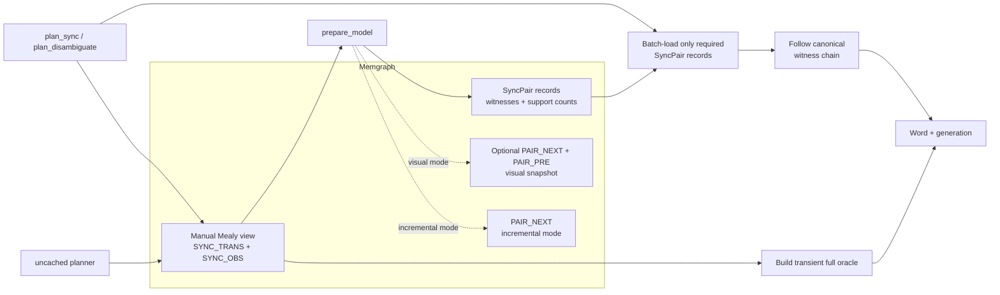
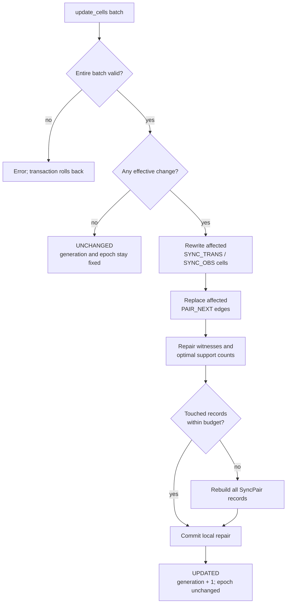

# sync-kgraph

`sync-kgraph` implements the synchronize-or-reveal algorithms from the
companion paper as a C23 library and a native Memgraph query module. It treats a
manually mapped knowledge-graph view as a deterministic Mealy automaton and can:

- validate complete transition and observation functions;
- build and persist an epoch-scoped pair merge/resolution oracle;
- lazily read only the persisted witnesses needed by a plan;
- atomically repair pair witnesses after transition or observation changes;
- recompute the oracle from the base view for cache-free ablation;
- plan an open-loop word that synchronizes a hypothesis set;
- plan an output-partitioning word that reveals the current hypothesis;
- fall back to exact bounded partition BFS when a pair witness is insufficient;
- explain predicted supports and output branches after every action; and
- monitor localization updates as `CONTINUE`, `REPLAN`, `MODEL_VIOLATION`,
  `STALE_GENERATION`, or `WAIT`.

All algorithm and Memgraph module code is C23. Cypher is used only for schema,
mapping, and example queries. Meson builds the library, CLI, tests, and optional
Memgraph module.

## Build And Test

Core build:

```sh
CC=clang meson setup build -Dmemgraph=disabled
meson compile -C build
meson test -C build --print-errorlogs
./build/sync-kgraph-cli --example warehouse
```

Build the native module against the header installed with the target Memgraph
server. This is preferred over using a header from a different release:

```sh
CC=clang meson setup build-memgraph \
  -Dmemgraph=enabled \
  -Dmemgraph_include_dir=/usr/include/memgraph
meson compile -C build-memgraph
```

The Linux artifact is `build-memgraph/sync.so`; macOS produces the native
shared-module equivalent. Install with Meson, or place that file in the
server's query-module directory and load it:

```cypher
CALL mg.load("sync");
CALL mg.procedures() YIELD name
WITH name
WHERE name STARTS WITH "sync."
RETURN name ORDER BY name;
```

Expected procedure names:

```text
sync.explain_plan
sync.mark_dirty
sync.plan_disambiguate
sync.plan_disambiguate_uncached
sync.plan_sync
sync.plan_sync_uncached
sync.prepare_model
sync.update_cells
sync.validate_update
```

Run the local integration test with an already installed Memgraph:

```sh
sh scripts/memgraph_local_smoke.sh build-memgraph
```

It starts a separate Memgraph process on a temporary port with private data,
log, and module directories. It never connects to or modifies the normal
Memgraph instance on port 7687. It also writes the representative ablation
timings to `build-memgraph/ablation.csv` and
`build-memgraph/ablation-updates.csv`.

## Manual View Contract

Run `cypher/install_schema.cypher` once. The application schema is otherwise
untouched. Create dedicated view nodes and relationships for each model:

```cypher
(:SyncModel {
  model, generation, dirty, prepared_generation?, oracle_epoch?, incremental?
})
(:SyncState {
  model, state_key, state_id?, semantic_ref?, orientation?
})
(:SyncAction {
  model, action_key, action_id?
})
(:SyncOutput {
  model, output_key, output_id?
})
(:SyncState)-[:SYNC_TRANS {
  model, action_key
}]->(:SyncState)
(:SyncState)-[:SYNC_OBS {
  model, action_key
}]->(:SyncOutput)
```

Keys must be unique within their domain and model. For every state/action pair,
there must be exactly one `SYNC_TRANS` and one `SYNC_OBS`. An observation is the
output emitted for the source state and selected action. Optional numeric IDs
only control stable ordering; keys are the public interface.

The mapping is deliberately manual because only the database owner knows how
application entities, orientations, commands, and sensor abstractions form the
automaton. Prefer separate `SyncState` nodes linked by `semantic_ref` or an
application-owned relationship instead of adding `SyncState` to application
nodes. The supplied uninstall script deletes nodes in the Sync-KGraph
namespace.

After creating the view:

1. Set `dirty: true` and advance `generation`, or call
   `sync.mark_dirty(model)` for an existing model.
2. Call `sync.prepare_model(model, materialize_pair_edges, incremental)`.
3. Store the returned generation with every plan.
4. Reject or replan work when monitor output is `STALE_GENERATION`.

`prepare_model` validates the strict Mealy model and always persists one
`SyncPair` record for every unordered pair with repetition. Passing `true` for
`materialize_pair_edges` also persists `PAIR_NEXT` and `PAIR_PRE` relationships
for inspection. Incremental mode persists `PAIR_NEXT` because repair needs the
forward pair graph; it does not persist redundant `PAIR_PRE` relationships.
The two booleans cannot both be true.

| `materialize_pair_edges` | `incremental` | Persisted auxiliary state |
| --- | --- | --- |
| `false` | `false` | `SyncPair` records only |
| `true` | `false` | `SyncPair`, `PAIR_NEXT`, and `PAIR_PRE` |
| `false` | `true` | `SyncPair` and `PAIR_NEXT` |

`oracle_epoch` identifies a complete compatible auxiliary graph. Generation
advances after each effective base-view change, while the epoch remains stable
across successful incremental repairs. Repreparing replaces the auxiliary graph
and advances the epoch.

Preparation and plan reads follow this lifecycle:



The trigger file is a template, not a generic installed trigger. Adapt its
predicate to the application labels and relationships that feed each model. A
schema-agnostic trigger cannot identify the affected model safely. Exclude
writes made by `update_cells` because that procedure handles generation and
repair atomically.

## Procedure Interface

### Persisted Planning API

```cypher
CALL sync.prepare_model(
  model, materialize_pair_edges = false, incremental = false)
CALL sync.plan_sync(model, hypotheses, budget)
CALL sync.plan_disambiguate(model, hypotheses, bound, budget)
```

The cached planners require a clean prepared model. They read the
required epoch-scoped witnesses lazily from `SyncPair` in batched reads instead
of loading every pair or rerunning the merge and resolution searches. Snapshot
planners do not read `PAIR_NEXT` or `PAIR_PRE`.

### Incremental Maintenance API

```cypher
CALL sync.prepare_model(model, false, true)
CALL sync.update_cells(model, changes, repair_budget = 0)
```

Each change is a map containing `state_key`, `action_key`, and at least one of
`target_key` or `output_key`. The procedure validates the entire nonempty batch
before writing, updates `SYNC_TRANS` and `SYNC_OBS`, replaces the affected
`PAIR_NEXT` entries, and repairs merge and resolution witnesses in one
transaction. Duplicate cells and unknown keys are rejected. A batch containing
only current values returns `UNCHANGED` without advancing generation.

`repair_budget = 0` uses `ceil(pair_count / 4)`. If repair touches more records
than the budget, the procedure rebuilds all pair records in the same transaction
and returns `fallback_rebuild: true`. This preserves exact results and puts a
bound on incremental work. The update result reports changed cells, directly
changed pair edges, touched pair records, invalidations, fallback use, and
maintenance time.

This is DynFO-inspired incremental maintenance, not a claim of formal DynFO
dynamic complexity: the C repair engine maintains witnesses and support counts
over the stored pair graph, but Memgraph queries, transaction work, and a
bounded full-rebuild fallback remain part of the implementation.

An incremental update stays inside one write transaction:



### Uncached Ablation API

```cypher
CALL sync.plan_sync_uncached(model, hypotheses, budget)
CALL sync.plan_disambiguate_uncached(model, hypotheses, bound, budget)
```

The uncached planners validate the current base Mealy view and rebuild the pair
oracle in transient C memory on every call. They work on dirty or unprepared
models and never read or write `SyncPair`, `PAIR_NEXT`, `PAIR_PRE`, `dirty`, or
`prepared_generation`. Their transient allocations are freed before the call
returns.

All three modes are available for controlled comparison:

- uncached planning measures full reconstruction from the base view;
- persisted planning measures lazy witness reads;
- incremental maintenance measures repairing derived state after mutations.

On the same generation, hypotheses, bound, and budget, cached and uncached
semantic fields must match exactly. Persisted witnesses and local repair reduce
recomputation or touched records, but they do not guarantee lower wall-clock
latency for every graph. Database query overhead remains measurable.

All four planner procedures additionally return:

| Field | Cached value | Uncached value | Meaning |
| --- | --- | --- | --- |
| `oracle_source` | `PERSISTED` | `RECOMPUTED` | Source of pair witnesses |
| `oracle_builds` | `0` | `1` | Calls to the full oracle builder |
| `oracle_rows_loaded` | Witness path rows | `0` | Pair records read from Memgraph |
| `oracle_load_batches` | Batched reads | `0` | Pair-record queries |
| `oracle_cache_hits` | Reused rows | `0` | In-call witness-cache hits |
| `oracle_time_us` | Variable | Variable | Lazy record reads or rebuilding time |
| `total_compute_time_us` | Variable | Variable | Base-view extraction through planner completion |

`planning_time_us` remains the time spent only in the core word planner.
`total_compute_time_us` excludes result encoding, Bolt transport, and client
latency. Timing fields and oracle metadata are excluded from semantic
equivalence checks.

Pair records created before this epoch schema do not contain support counts or
`oracle_epoch`; re-run `prepare_model` after upgrading.

### Supporting API

```cypher
CALL sync.explain_plan(model, generation, hypotheses, word)
CALL sync.validate_update(
  model, generation, hypotheses, word, completed_steps,
  reported_hypotheses, localizer_available = true)
CALL sync.mark_dirty(model)
```

`hypotheses`, `reported_hypotheses`, and returned supports are lists of
`state_key` strings. Words are lists of `action_key` strings. `budget` limits
search expansions; `bound` is the required worst-case output-branch support
size. A bound of one requests a homing word.

Planner calls return an `outcome` of `PLAN`, `ALREADY_SATISFIED`, `NO_PLAN`, or
`RESOURCE_BOUND`, and a `method` of `PAIR_MERGE`, `PAIR_RESOLUTION`,
`PARTITION_BFS`, or `NONE`. Explanation and monitoring retain the prepared-model
lifecycle even when a word was obtained through the uncached API.

The public C API is in `include/sync_kgraph/sync.h`. It exposes the same
automaton builder, pair oracle, planners, explanation visitor, and monitor
without requiring Memgraph.

## Worked Warehouse Example

The example maps two ambiguous bays, two corridor poses, and one dock pose.
Run each numbered file with `mgconsole`, or execute the queries shown below.

### 1. Install The Schema

```sh
mgconsole < cypher/install_schema.cypher
```

Expected: ten indexes are created and no data rows are returned. Reuse these
indexes for every mapped model.

### 2. Load The Manual View

```sh
mgconsole < examples/warehouse/00_reset_and_load.cypher
```

Verify the mapping:

```cypher
MATCH (m:SyncModel {model: "warehouse"})
OPTIONAL MATCH (s:SyncState {model: "warehouse"})
WITH m, count(s) AS states
OPTIONAL MATCH (a:SyncAction {model: "warehouse"})
WITH m, states, count(a) AS actions
OPTIONAL MATCH (o:SyncOutput {model: "warehouse"})
RETURN m.generation AS generation, m.dirty AS dirty,
       states, actions, count(o) AS outputs;
```

Expected:

```text
generation: 1, dirty: true, states: 5, actions: 4, outputs: 4
```

The view contains 20 transitions and 20 observations, one of each per
state/action cell.

### 3. Plan Without The Cache

The freshly loaded model is dirty and has no auxiliary records. Compute a
synchronizing word directly from the base view:

```cypher
CALL sync.plan_sync_uncached(
  "warehouse", ["west_bay:east", "east_bay:west"], 64)
YIELD status, outcome, method, word, length, final_state_key,
      final_support_size, generation, oracle_source, oracle_builds
RETURN status, outcome, method, word, length, final_state_key,
       final_support_size, generation, oracle_source, oracle_builds;
```

Expected:

```text
"OK", "PLAN", "PAIR_MERGE", ["to_corridor", "go_west"], 2,
"dock:north", 1, 1, "RECOMPUTED", 1
```

Compute the homing word through the same uncached path:

```cypher
CALL sync.plan_disambiguate_uncached(
  "warehouse", ["west_bay:east", "east_bay:west"], 1, 64)
YIELD status, outcome, method, word, length, best_support_size,
      worst_support_size, branch_count, homing, generation,
      oracle_source, oracle_builds
RETURN status, outcome, method, word, length, best_support_size,
       worst_support_size, branch_count, homing, generation,
       oracle_source, oracle_builds;
```

Expected:

```text
"OK", "PLAN", "PAIR_RESOLUTION", ["to_corridor"], 1,
1, 1, 2, true, 1, "RECOMPUTED", 1
```

Confirm that neither call materialized auxiliary graph data:

```cypher
OPTIONAL MATCH (p:SyncPair {model: "warehouse"})
WITH count(p) AS pairs
OPTIONAL MATCH ()-[r:PAIR_NEXT|PAIR_PRE {model: "warehouse"}]->()
RETURN pairs, count(r) AS pair_relationships;
```

Expected:

```text
pairs: 0, pair_relationships: 0
```

### 4. Prepare The Cached Model

```cypher
CALL sync.prepare_model("warehouse", true)
YIELD status, generation, oracle_epoch, states, actions, outputs, transitions,
      pairs, pair_edges, mergeable_pairs, resolvable_pairs,
      materialized_pair_edges, incremental_enabled
RETURN status, generation, oracle_epoch, states, actions, outputs, transitions,
       pairs, pair_edges, mergeable_pairs, resolvable_pairs,
       materialized_pair_edges, incremental_enabled;
```

Expected:

```text
"OK", 1, 1, 5, 4, 4, 20, 15, 60, 15, 15, true, false
```

There are 15 unordered state pairs with repetition and 60 pair/action edges.
Because edge materialization was enabled, the graph contains 15 `SyncPair`, 60
`PAIR_NEXT`, and 60 `PAIR_PRE` records.

### 5. Plan Synchronization From Persisted Witnesses

```cypher
CALL sync.plan_sync(
  "warehouse", ["west_bay:east", "east_bay:west"], 64)
YIELD status, outcome, method, word, length, final_state_key,
      final_support_size, generation, oracle_source, oracle_builds
RETURN status, outcome, method, word, length, final_state_key,
       final_support_size, generation, oracle_source, oracle_builds;
```

Expected:

```text
"OK", "PLAN", "PAIR_MERGE", ["to_corridor", "go_west"], 2,
"dock:north", 1, 1, "PERSISTED", 0
```

The semantic columns exactly match the uncached synchronization result. Only
the oracle metadata and timing fields differ.

### 6. Plan Disambiguation From Persisted Witnesses

```cypher
CALL sync.plan_disambiguate(
  "warehouse", ["west_bay:east", "east_bay:west"], 1, 64)
YIELD status, outcome, method, word, length, best_support_size,
      worst_support_size, branch_count, homing, generation,
      oracle_source, oracle_builds
RETURN status, outcome, method, word, length, best_support_size,
       worst_support_size, branch_count, homing, generation,
       oracle_source, oracle_builds;
```

Expected:

```text
"OK", "PLAN", "PAIR_RESOLUTION", ["to_corridor"], 1,
1, 1, 2, true, 1, "PERSISTED", 0
```

The two bays emit different landmark outputs under `to_corridor`, so one
action partitions the initial support into two singleton branches. This result
also exactly matches the uncached homing result.

### 7. Explain The Synchronizing Word

```cypher
CALL sync.explain_plan(
  "warehouse", 1,
  ["west_bay:east", "east_bay:west"],
  ["to_corridor", "go_west"])
YIELD step, action, predicted_hypotheses, output_trace, branch_hypotheses
RETURN step, action, predicted_hypotheses, output_trace, branch_hypotheses
ORDER BY step, output_trace;
```

Expected rows:

```text
0, "", [west_bay:east, east_bay:west], [],
   [west_bay:east, east_bay:west]
1, "to_corridor", [corridor_w:east, corridor_e:west],
   [west_landmark], [corridor_w:east]
1, "to_corridor", [corridor_w:east, corridor_e:west],
   [east_landmark], [corridor_e:west]
2, "go_west", [dock:north], [west_landmark, dock], [dock:north]
2, "go_west", [dock:north], [east_landmark, dock], [dock:north]
```

### 8. Validate A Localization Update

```cypher
CALL sync.validate_update(
  "warehouse", 1,
  ["west_bay:east", "east_bay:west"],
  ["to_corridor", "go_west"], 1,
  ["corridor_w:east", "corridor_e:west"], true)
YIELD status, decision, expected_hypotheses, unexpected_hypotheses, generation
RETURN status, decision, expected_hypotheses, unexpected_hypotheses, generation;
```

Expected:

```text
"OK", "CONTINUE", [corridor_w:east, corridor_e:west], [], 1
```

Reporting only one expected corridor returns `REPLAN`; reporting `dock:north`
at this step returns `MODEL_VIOLATION`; passing an unavailable localizer returns
`WAIT`.

### 9. Invalidate Old Plans

```cypher
CALL sync.mark_dirty("warehouse") YIELD status, generation
RETURN status, generation;
```

Expected:

```text
"DIRTY", 2
```

Cached planning is now rejected until
`sync.prepare_model("warehouse", false)` succeeds. Uncached planning remains
available against the current base view and returns generation 2. A monitor
call carrying generation 1 returns:

```text
status: "OK", decision: "STALE_GENERATION", generation: 2
```

### 10. Prepare And Update Incrementally

Prepare the dirty generation in incremental mode. This replaces the visual
snapshot with one forward pair graph:

```cypher
CALL sync.prepare_model("warehouse", false, true)
YIELD status, generation, oracle_epoch, pairs, pair_edges,
      materialized_pair_edges, incremental_enabled
RETURN status, generation, oracle_epoch, pairs, pair_edges,
       materialized_pair_edges, incremental_enabled;
```

Expected:

```text
"OK", 2, 2, 15, 60, true, true
```

Change one observation cell:

```cypher
CALL sync.update_cells("warehouse", [{
  state_key: "east_bay:west",
  action_key: "to_wall",
  output_key: "east_landmark"
}], 15)
YIELD status, generation, oracle_epoch, changed_cells, direct_pair_edges,
      fallback_rebuild
RETURN status, generation, oracle_epoch, changed_cells, direct_pair_edges,
       fallback_rebuild;
```

Expected:

```text
"UPDATED", 3, 2, 1, 5, false
```

The five direct edges are the `to_wall` edges for the five unordered pairs
containing `east_bay:west`. The epoch stays at 2 while generation advances.
Repeating the same value is a no-op:

```cypher
CALL sync.update_cells("warehouse", [{
  state_key: "east_bay:west",
  action_key: "to_wall",
  output_key: "east_landmark"
}], 15)
YIELD status, generation, oracle_epoch, changed_cells, direct_pair_edges
RETURN status, generation, oracle_epoch, changed_cells, direct_pair_edges;
```

Expected:

```text
"UNCHANGED", 3, 2, 0, 0
```

Cached and uncached homing calls still return `["to_corridor"]` with generation
3. An invalid key aborts the whole batch and leaves generation, base cells, and
the oracle unchanged.

## Quality And Releases

Run the standalone Memgraph ablation suite against a loaded local module:

```sh
sh scripts/memgraph_ablation.sh build-memgraph/ablation.csv local
```

It constructs a temporary deterministic model with 210 states and 9 actions,
representing 22,155 state pairs and 199,395 pair/action entries. After one
warm-up call, it measures seven synchronization and seven homing calls for each
oracle source. A second 24-state fixture performs one bounded local repair and
one forced fallback rebuild. The command fails on semantic disagreement,
incorrect oracle-source metrics, nonlocal direct-edge work, an unexpected
fallback, or graph-contract failure, then removes both fixtures.

Expected CSV columns:

```text
planner,oracle_source,runs,oracle_builds_per_call,median_oracle_time_us,median_total_compute_time_us,median_oracle_rows_loaded,median_oracle_load_batches,median_oracle_cache_hits
```

The companion `ablation-updates.csv` reports:

```text
mode,generation,changed_cells,direct_pair_edges,pair_records_touched,fallback_rebuild,maintenance_time_us
```

The deterministic work gates require persisted planners to load fewer than all
pair rows, uncached planners to build exactly one oracle, local repair to touch
fewer than 300 pair records, and forced fallback to rewrite all 300. Timing
values are observations, not pass thresholds: fewer records can still take
longer when database-query overhead dominates. CI uploads both CSV files as
`memgraph-ablation-timings`.

```sh
sh scripts/check-format.sh
sh scripts/run-clang-tidy.sh build-tidy
sh scripts/valgrind.sh build-valgrind
sh scripts/coverage.sh build-coverage /usr/include/memgraph
```

CI treats all Clang diagnostics as errors, runs every unit test under Valgrind
with all leak kinds fatal, compiles against multiple Memgraph C API versions,
and runs the full Memgraph integration and ablation contracts. Coverage
includes every production C source file, including the CLI and Memgraph
adapter, and fails below 75% line coverage.

Release tags publish `linux-x86_64` and native `macos-arm64` archives. Each
archive includes the CLI, C library and header, Memgraph module, Cypher mapping
scripts, Memgraph Lab GSS view, worked example, license, and SHA-256 checksum.
